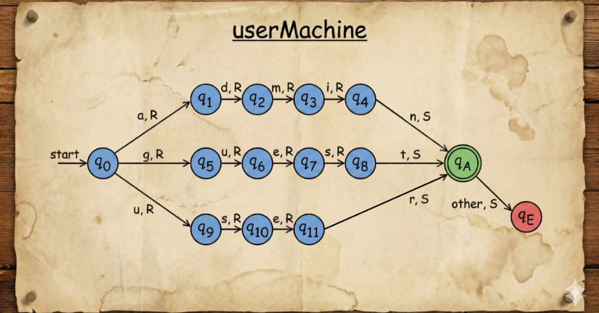

# Proyecto: Simulador de Máquina de Turing

## 1. Diagramas AFD (ASCII)

### a) PIN (4 o 6 dígitos)

- `qA` → aceptación (4 o 6 dígitos)  
- `qE` → rechazo (otra longitud)

### b) Password (mínimo 8 caracteres alfanuméricos)

        
- Cada `d/l` significa que puede ser dígito (`d`) o letra (`l`)  
- `_` = símbolo blanco que indica fin de la cadena

### c) User (admin, guest, user)

- `l` = cualquier letra.  

### d) Inventario (INV-###)

                                                                         
- `d` = cualquier dígito  
- `_` = símbolo blanco al final de la cadena

## 2. Tabla de transición completa de las MT

### a) PIN (4 o 6 dígitos)

| Estado | Símbolo | Estado Siguiente | Movimiento | Símbolo Escrito |
|--------|---------|-----------------|------------|----------------|
| q0     | d       | q1              | R          | d              |
| q1     | d       | q2              | R          | d              |
| q2     | d       | q3              | R          | d              |
| q3     | d       | q4              | R          | d              |
| q3     | _       | qA              | S          | _              |
| q4     | d       | q5              | R          | d              |
| q4     | _       | qE              | S          | _              |
| q5     | d       | q6              | R          | d              |
| q5     | _       | qE              | S          | _              |
| q6     | _       | qA              | S          | _              |

### b) Password (mínimo 8 caracteres alfanuméricos)

| Estado | Símbolo | Estado Siguiente | Movimiento | Símbolo Escrito |
|--------|---------|-----------------|------------|----------------|
| q0     | d/l     | q1              | R          | d/l            |
| q1     | d/l     | q2              | R          | d/l            |
| q2     | d/l     | q3              | R          | d/l            |
| q3     | d/l     | q4              | R          | d/l            |
| q4     | d/l     | q5              | R          | d/l            |
| q5     | d/l     | q6              | R          | d/l            |
| q6     | d/l     | q7              | R          | d/l            |
| q7     | d/l     | q8              | R          | d/l            |
| q8     | _       | qA              | S          | _              |

### c) User (admin, guest, user)

| Estado | Símbolo | Estado Siguiente | Movimiento | Símbolo Escrito |
|--------|---------|-----------------|------------|----------------|
| q0     | a       | q1              | R          | a              |
| q1     | d       | q2              | R          | d              |
| q2     | m       | q3              | R          | m              |
| q3     | i       | q4              | R          | i              |
| q4     | n       | qA              | S          | n              |
| q0     | g       | q5              | R          | g              |
| q5     | u       | q6              | R          | u              |
| q6     | e       | q7              | R          | e              |
| q7     | s       | q8              | R          | s              |
| q8     | t       | qA              | S          | t              |
| q0     | u       | q9              | R          | u              |
| q9     | s       | q10             | R          | s              |
| q10    | e       | q11             | R          | e              |
| q11    | r       | qA              | S          | r              |

### d) Inventario (INV-###)

| Estado | Símbolo | Estado Siguiente | Movimiento | Símbolo Escrito |
|--------|---------|-----------------|------------|----------------|
| q0     | I       | q1              | R          | I              |
| q1     | N       | q2              | R          | N              |
| q2     | V       | q3              | R          | V              |
| q3     | -       | q4              | R          | -              |
| q4     | d       | q5              | R          | d              |
| q5     | d       | q6              | R          | d              |
| q6     | d       | q7              | R          | d              |
| q7     | _       | qA              | S          | _              |
| q7     | d,l     | qE              | S          | _              |

**Notas generales:**  
- `_` = símbolo blanco en la cinta.  
- `d` = cualquier dígito del 0 al 9.  
- `l` = cualquier letra.  
- `S` = head se queda en la misma posición.  
- Si un símbolo no coincide con la transición, se va a estado de rechazo `qE`.

---

**Autor:** Andrea Orrego Franco 
**Repositorio:** https://github.com/andreaorrego/maquina_turing.git
